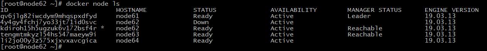

## Docker Swarm安装


### 一、Docker Swarm命令帮助
```shell
# docker swarm 子命令
[root@node61 ~]# docker swarm --help

Usage:  docker swarm COMMAND

Manage Swarm

Commands:
  ca          Display and rotate(旋转、循环) the root CA
  init        Initialize a swarm(初始化)
  join        Join a swarm as a node and/or manager，增加管理节点或工作节点
  join-token  Manage join tokens， 管理令牌
  leave       Leave the swarm，使节点离开swarm集群
  unlock      Unlock swarm，解锁swarm集群
  unlock-key  Manage the unlock key， 管理解锁密钥
  update      Update the swarm，更新swarm配置

Run 'docker swarm COMMAND --help' for more information on a command.

# swarm初始化参数
[root@node61 ~]# docker swarm init --help

Usage:  docker swarm init [OPTIONS]

Initialize a swarm

Options:
      --advertise-addr string                  Advertised address (format: <ip|interface>[:port])
      --autolock                               Enable manager autolocking (requiring an unlock key to start a stopped manager)
      --availability string                    Availability of the node ("active"|"pause"|"drain") (default "active")
      --cert-expiry duration                   Validity period for node certificates (ns|us|ms|s|m|h) (default 2160h0m0s)
      --data-path-addr string                  Address or interface to use for data path traffic (format: <ip|interface>)
      --data-path-port uint32                  Port number to use for data path traffic (1024 - 49151). If no value is set or is
                                               set to 0, the default port (4789) is used.
      --default-addr-pool ipNetSlice           default address pool in CIDR format (default [])
      --default-addr-pool-mask-length uint32   default address pool subnet mask length (default 24)
      --dispatcher-heartbeat duration          Dispatcher heartbeat period (ns|us|ms|s|m|h) (default 5s)
      --external-ca external-ca                Specifications of one or more certificate signing endpoints
      --force-new-cluster                      Force create a new cluster from current state
      --listen-addr node-addr                  Listen address (format: <ip|interface>[:port]) (default 0.0.0.0:2377)
      --max-snapshots uint                     Number of additional Raft snapshots to retain
      --snapshot-interval uint                 Number of log entries between Raft snapshots (default 10000)
      --task-history-limit int                 Task history retention limit (default 5)
      
# 生成swarm集群令牌
[root@node64 ~]# docker swarm join-token --help

Usage:  docker swarm join-token [OPTIONS] (worker|manager)

Manage join tokens

Options:
  -q, --quiet    Only display token
      --rotate   Rotate join token
```

### 二、基础环境准备

1. 准备4台CentOS7虚拟机

```shell
node61	192.168.128.61 （manager）
node62	192.168.128.62	(manager)
node63	192.168.128.63	(manager)
node64	192.168.128.64	(work)
```

2. 创建swarm集群

```shell
# node61，设置第1个管理节点
[root@node61 ~]# docker swarm init --advertise-addr 192.168.128.61
Swarm initialized: current node (qv6jlg82iwcdym9mhqspxdfyd) is now a manager.

To add a worker to this swarm, run the following command:

    docker swarm join --token SWMTKN-1-5e0fszad9vwmzlixw4wj7ta0i7ayp8pt4jk3fr7gc9qdi47bk1-2hk87q61nyugqq8v6hw7tfv3n 192.168.128.61:2377

To add a manager to this swarm, run 'docker swarm join-token manager' and follow the instructions.

```
3. 生成节点加入密钥
```
docker swarm join-token worker
docker swarm join-token manager
```

4、添加管理节点和工作节点
```
# 生成管理节点添加密钥
[root@node61 ~]# docker swarm join-token manager
To add a manager to this swarm, run the following command:

    docker swarm join --token SWMTKN-1-5e0fszad9vwmzlixw4wj7ta0i7ayp8pt4jk3fr7gc9qdi47bk1-bj02yv41x3uhdu1ar0dcnj1n2 192.168.128.61:2377


# node62, 设置第2个管理节点

# node63, 设置第3个管理节点
[root@node63 ~]# docker swarm join --token SWMTKN-1-5e0fszad9vwmzlixw4wj7ta0i7ayp8pt4jk3fr7gc9qdi47bk1-bj02yv41x3uhdu1ar0dcnj1n2 192.168.128.61:2377
This node joined a swarm as a manager.

# node64, 设置第4个节点为worker节点
# 先在node61上生成swarm集群加入令牌，再到node64上执行
[root@node61 ~]# docker swarm join-token worker
To add a worker to this swarm, run the following command:

    docker swarm join --token SWMTKN-1-5e0fszad9vwmzlixw4wj7ta0i7ayp8pt4jk3fr7gc9qdi47bk1-2hk87q61nyugqq8v6hw7tfv3n 192.168.128.61:2377

# 修改ntp时间后添加成功
[root@node64 ~]# docker swarm join --token SWMTKN-1-5e0fszad9vwmzlixw4wj7ta0i7ayp8pt4jk3fr7gc9qdi47bk1-2hk87q61nyugqq8v6hw7tfv3n 192.168.128.61:2377
This node joined a swarm as a worker.

# 删除未在线的结点
[root@node62 ~]# docker node rm 4y4gy4fchj7yo33jt71id0svc
4y4gy4fchj7yo33jt71id0svc

# 添加完成后显示节点信息
[root@node62 ~]# docker node ls
ID                            HOSTNAME            STATUS              AVAILABILITY        MANAGER STATUS      ENGINE VERSION
qv6jlg82iwcdym9mhqspxdfyd     node61              Ready               Active              Leader              19.03.13
kdiroh15h5ugzuk6v172bsf4r *   node62              Ready               Active              Reachable           19.03.13
tengmtmkyzl54hs547maeyw9i     node63              Ready               Active              Reachable           19.03.13
li2jo00y3z575xjxvxavcgica     node64              Ready               Active                                  19.03.13
```



```shell
# 使用docker info查看节点信息
[root@node64 etc]# docker info
Client:
 Debug Mode: false

Server:
 Containers: 2
  Running: 0
  Paused: 0
  Stopped: 2
 Images: 1
 Server Version: 19.03.13
 Storage Driver: devicemapper
  Pool Name: docker-253:0-134998167-pool
  Pool Blocksize: 65.54kB
  Base Device Size: 10.74GB
  Backing Filesystem: xfs
  Udev Sync Supported: true
  Data file: /dev/loop0
  Metadata file: /dev/loop1
  Data loop file: /var/lib/docker/devicemapper/devicemapper/data
  Metadata loop file: /var/lib/docker/devicemapper/devicemapper/metadata
  Data Space Used: 24.58MB
  Data Space Total: 107.4GB
  Data Space Available: 63.61GB
  Metadata Space Used: 17.38MB
  Metadata Space Total: 2.147GB
  Metadata Space Available: 2.13GB
  Thin Pool Minimum Free Space: 10.74GB
  Deferred Removal Enabled: true
  Deferred Deletion Enabled: true
  Deferred Deleted Device Count: 0
  Library Version: 1.02.164-RHEL7 (2019-08-27)
 Logging Driver: json-file
 Cgroup Driver: cgroupfs
 Plugins:
  Volume: local
  Network: bridge host ipvlan macvlan null overlay
  Log: awslogs fluentd gcplogs gelf journald json-file local logentries splunk syslog
 Swarm: active
  NodeID: li2jo00y3z575xjxvxavcgica
  Is Manager: false
  Node Address: 192.168.128.64
  Manager Addresses:
   192.168.128.61:2377
   192.168.128.62:2377
   192.168.128.63:2377
 Runtimes: runc
 Default Runtime: runc
 Init Binary: docker-init
 containerd version: 8fba4e9a7d01810a393d5d25a3621dc101981175
 runc version: dc9208a3303feef5b3839f4323d9beb36df0a9dd
 init version: fec3683
 Security Options:
  seccomp
   Profile: default
 Kernel Version: 3.10.0-1062.12.1.el7.x86_64
 Operating System: CentOS Linux 7 (Core)
 OSType: linux
 Architecture: x86_64
 CPUs: 4
 Total Memory: 1.795GiB
 Name: node64
 ID: ZGLJ:FNIM:Q7CI:CCCZ:5AQF:KBCF:VZ6T:DXGV:AUZU:NKOQ:FIAF:E2JK
 Docker Root Dir: /var/lib/docker
 Debug Mode: false
 Registry: https://index.docker.io/v1/
 Labels:
 Experimental: false
 Insecure Registries:
  127.0.0.0/8
 Registry Mirrors:
  https://oxv7blf7.mirror.aliyuncs.com/
 Live Restore Enabled: false

WARNING: the devicemapper storage-driver is deprecated, and will be removed in a future release.
WARNING: devicemapper: usage of loopback devices is strongly discouraged for production use.
         Use `--storage-opt dm.thinpooldev` to specify a custom block storage device.
```


```shell
# 安装完成后网络会增加专有的swarm网络
[root@node61 etc]# docker network ls
NETWORK ID          NAME                DRIVER              SCOPE
jdb12gx754vh        ingress             overlay             swarm
```

集群搭建过程：

1. 生成主节点init
2. 加入管理节点或工作节点

### Rift一致性协议

Rift协议： 保证大多数节点存活集群才可用；