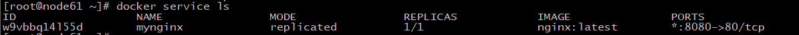

## Docker Swarm使用

容器升级为服务，服务里有一个概念是副本，相当于同时开启多台服务器；

```shell
[root@node61 ~]# docker service --help

Usage:  docker service COMMAND

Manage services

Commands:
  create      Create a new service, 创建服务
  inspect     Display detailed information on one or more services，查看细节
  logs        Fetch the logs of a service or task
  ls          List services
  ps          List the tasks of one or more services，显示服务
  rm          Remove one or more services，删除服务
  rollback    Revert changes to a service's configuration，回滚节点
  scale       Scale one or multiple replicated services， 扩展服务
  update      Update a service，更新服务

Run 'docker service COMMAND --help' for more information on a command.

[root@node61 ~]# docker service create --help

Usage:  docker service create [OPTIONS] IMAGE [COMMAND] [ARG...]

Create a new service

Options:
      --config config                      Specify configurations to expose to the service
      --constraint list                    Placement constraints
      --container-label list               Container labels
      --credential-spec credential-spec    Credential spec for managed service account (Windows only)
  -d, --detach                             Exit immediately instead of waiting for the service to converge
      --dns list                           Set custom DNS servers
      --dns-option list                    Set DNS options
      --dns-search list                    Set custom DNS search domains
      --endpoint-mode string               Endpoint mode (vip or dnsrr) (default "vip")
      --entrypoint command                 Overwrite the default ENTRYPOINT of the image
  -e, --env list                           Set environment variables
      --env-file list                      Read in a file of environment variables
      --generic-resource list              User defined resources
      --group list                         Set one or more supplementary user groups for the container
      --health-cmd string                  Command to run to check health
      --health-interval duration           Time between running the check (ms|s|m|h)
      --health-retries int                 Consecutive failures needed to report unhealthy
      --health-start-period duration       Start period for the container to initialize before counting retries towards
                                           unstable (ms|s|m|h)
      --health-timeout duration            Maximum time to allow one check to run (ms|s|m|h)
      --host list                          Set one or more custom host-to-IP mappings (host:ip)
      --hostname string                    Container hostname
      --init                               Use an init inside each service container to forward signals and reap processes
      --isolation string                   Service container isolation mode
  -l, --label list                         Service labels
      --limit-cpu decimal                  Limit CPUs
      --limit-memory bytes                 Limit Memory
      --log-driver string                  Logging driver for service
      --log-opt list                       Logging driver options
      --mode string                        Service mode (replicated or global) (default "replicated")
      --mount mount                        Attach a filesystem mount to the service
      --name string                        Service name
      --network network                    Network attachments
      --no-healthcheck                     Disable any container-specified HEALTHCHECK
      --no-resolve-image                   Do not query the registry to resolve image digest and supported platforms
      --placement-pref pref                Add a placement preference
  -p, --publish port                       Publish a port as a node port
  -q, --quiet                              Suppress progress output
      --read-only                          Mount the container's root filesystem as read only
      --replicas uint                      Number of tasks
      --replicas-max-per-node uint         Maximum number of tasks per node (default 0 = unlimited)
      --reserve-cpu decimal                Reserve CPUs
      --reserve-memory bytes               Reserve Memory
      --restart-condition string           Restart when condition is met ("none"|"on-failure"|"any") (default "any")
      --restart-delay duration             Delay between restart attempts (ns|us|ms|s|m|h) (default 5s)
      --restart-max-attempts uint          Maximum number of restarts before giving up
      --restart-window duration            Window used to evaluate the restart policy (ns|us|ms|s|m|h)
      --rollback-delay duration            Delay between task rollbacks (ns|us|ms|s|m|h) (default 0s)
      --rollback-failure-action string     Action on rollback failure ("pause"|"continue") (default "pause")
      --rollback-max-failure-ratio float   Failure rate to tolerate during a rollback (default 0)
      --rollback-monitor duration          Duration after each task rollback to monitor for failure (ns|us|ms|s|m|h) (default 5s)
      --rollback-order string              Rollback order ("start-first"|"stop-first") (default "stop-first")
      --rollback-parallelism uint          Maximum number of tasks rolled back simultaneously (0 to roll back all at once)
                                           (default 1)
      --secret secret                      Specify secrets to expose to the service
      --stop-grace-period duration         Time to wait before force killing a container (ns|us|ms|s|m|h) (default 10s)
      --stop-signal string                 Signal to stop the container
      --sysctl list                        Sysctl options
  -t, --tty                                Allocate a pseudo-TTY
      --update-delay duration              Delay between updates (ns|us|ms|s|m|h) (default 0s)
      --update-failure-action string       Action on update failure ("pause"|"continue"|"rollback") (default "pause")
      --update-max-failure-ratio float     Failure rate to tolerate during an update (default 0)
      --update-monitor duration            Duration after each task update to monitor for failure (ns|us|ms|s|m|h) (default 5s)
      --update-order string                Update order ("start-first"|"stop-first") (default "stop-first")
      --update-parallelism uint            Maximum number of tasks updated simultaneously (0 to update all at once) (default 1)
  -u, --user string                        Username or UID (format: <name|uid>[:<group|gid>])
      --with-registry-auth                 Send registry authentication details to swarm agents
  -w, --workdir string                     Working directory inside the container
```

### 1、创建服务和启动

```shell
[root@node61 ~]# docker service create -p 8080:80 --name mynginx nginx:latest
w9vbbq14l55du8ja9nohcheh3
overall progress: 1 out of 1 tasks 
1/1: running   [==================================================>] 
verify: Service converged 
```

理解二个概念：

docker run  容器启动命令，不具有扩缩容功能

docker service 服务，具有扩缩容功能，可以滚动更新

```shell
[root@node61 ~]# docker service ps mynginx
ID                  NAME                IMAGE               NODE                DESIRED STATE       CURRENT STATE            ERROR               PORTS
p75rtqxv4bgl        mynginx.1           nginx:latest        node62              Running             Running 12 minutes ago 

[root@node61 ~]# docker service ls
ID                  NAME                MODE                REPLICAS            IMAGE               PORTS
w9vbbq14l55d        mynginx             replicated          1/1                 nginx:latest        *:8080->80/tcp
```



```shell
[root@node61 ~]# docker service inspect mynginx
[
    {
        "ID": "w9vbbq14l55du8ja9nohcheh3",
        "Version": {
            "Index": 89
        },
        "CreatedAt": "2020-10-30T06:37:09.982965163Z",
        "UpdatedAt": "2020-10-30T06:37:09.9918993Z",
        "Spec": {
            "Name": "mynginx",
            "Labels": {},
            "TaskTemplate": {
                "ContainerSpec": {
                    "Image": "nginx:latest@sha256:ed7f815851b5299f616220a63edac69a4cc200e7f536a56e421988da82e44ed8",
                    "Init": false,
                    "StopGracePeriod": 10000000000,
                    "DNSConfig": {},
                    "Isolation": "default"
                },
                "Resources": {
                    "Limits": {},
                    "Reservations": {}
                },
                "RestartPolicy": {
                    "Condition": "any",
                    "Delay": 5000000000,
                    "MaxAttempts": 0
                },
                "Placement": {
                    "Platforms": [
                        {
                            "Architecture": "amd64",
                            "OS": "linux"
                        },
                        {
                            "OS": "linux"
                        },
                        {
                            "OS": "linux"
                        },
                        {
                            "Architecture": "arm64",
                            "OS": "linux"
                        },
                        {
                            "Architecture": "386",
                            "OS": "linux"
                        },
                        {
                            "Architecture": "mips64le",
                            "OS": "linux"
                        },
                        {
                            "Architecture": "ppc64le",
                            "OS": "linux"
                        },
                        {
                            "Architecture": "s390x",
                            "OS": "linux"
                        }
                    ]
                },
                "ForceUpdate": 0,
                "Runtime": "container"
            },
            "Mode": {
                "Replicated": {
                    "Replicas": 1
                }
            },
            "UpdateConfig": {
                "Parallelism": 1,
                "FailureAction": "pause",
                "Monitor": 5000000000,
                "MaxFailureRatio": 0,
                "Order": "stop-first"
            },
            "RollbackConfig": {
                "Parallelism": 1,
                "FailureAction": "pause",
                "Monitor": 5000000000,
                "MaxFailureRatio": 0,
                "Order": "stop-first"
            },
            "EndpointSpec": {
                "Mode": "vip",
                "Ports": [
                    {
                        "Protocol": "tcp",
                        "TargetPort": 80,
                        "PublishedPort": 8080,
                        "PublishMode": "ingress"
                    }
                ]
            }
        },
        "Endpoint": {
            "Spec": {
                "Mode": "vip",
                "Ports": [
                    {
                        "Protocol": "tcp",
                        "TargetPort": 80,
                        "PublishedPort": 8080,
                        "PublishMode": "ingress"
                    }
                ]
            },
            "Ports": [
                {
                    "Protocol": "tcp",
                    "TargetPort": 80,
                    "PublishedPort": 8080,
                    "PublishMode": "ingress"
                }
            ],
            "VirtualIPs": [
                {
                    "NetworkID": "jdb12gx754vhqypvn1g5ohbvt",
                    "Addr": "10.0.0.16/24"
                }
            ]
        }
    }
]
```

### 2、更新服务的参数 

```shell
[root@node61 ~]# docker service update --help

Usage:  docker service update [OPTIONS] SERVICE

Update a service

Options:
      --args command                       Service command args
      --config-add config                  Add or update a config file on a service
      --config-rm list                     Remove a configuration file
      --constraint-add list                Add or update a placement constraint
      --constraint-rm list                 Remove a constraint
      --container-label-add list           Add or update a container label
      --container-label-rm list            Remove a container label by its key
      --credential-spec credential-spec    Credential spec for managed service account (Windows only)
  -d, --detach                             Exit immediately instead of waiting for the service to converge
      --dns-add list                       Add or update a custom DNS server
      --dns-option-add list                Add or update a DNS option
      --dns-option-rm list                 Remove a DNS option
      --dns-rm list                        Remove a custom DNS server
      --dns-search-add list                Add or update a custom DNS search domain
      --dns-search-rm list                 Remove a DNS search domain
      --endpoint-mode string               Endpoint mode (vip or dnsrr)
      --entrypoint command                 Overwrite the default ENTRYPOINT of the image
      --env-add list                       Add or update an environment variable
      --env-rm list                        Remove an environment variable
      --force                              Force update even if no changes require it
      --generic-resource-add list          Add a Generic resource
      --generic-resource-rm list           Remove a Generic resource
      --group-add list                     Add an additional supplementary user group to the container
      --group-rm list                      Remove a previously added supplementary user group from the container
      --health-cmd string                  Command to run to check health
      --health-interval duration           Time between running the check (ms|s|m|h)
      --health-retries int                 Consecutive failures needed to report unhealthy
      --health-start-period duration       Start period for the container to initialize before counting retries towards
                                           unstable (ms|s|m|h)
      --health-timeout duration            Maximum time to allow one check to run (ms|s|m|h)
      --host-add list                      Add a custom host-to-IP mapping (host:ip)
      --host-rm list                       Remove a custom host-to-IP mapping (host:ip)
      --hostname string                    Container hostname
      --image string                       Service image tag
      --init                               Use an init inside each service container to forward signals and reap processes
      --isolation string                   Service container isolation mode
      --label-add list                     Add or update a service label
      --label-rm list                      Remove a label by its key
      --limit-cpu decimal                  Limit CPUs
      --limit-memory bytes                 Limit Memory
      --log-driver string                  Logging driver for service
      --log-opt list                       Logging driver options
      --mount-add mount                    Add or update a mount on a service
      --mount-rm list                      Remove a mount by its target path
      --network-add network                Add a network
      --network-rm list                    Remove a network
      --no-healthcheck                     Disable any container-specified HEALTHCHECK
      --no-resolve-image                   Do not query the registry to resolve image digest and supported platforms
      --placement-pref-add pref            Add a placement preference
      --placement-pref-rm pref             Remove a placement preference
      --publish-add port                   Add or update a published port
      --publish-rm port                    Remove a published port by its target port
  -q, --quiet                              Suppress progress output
      --read-only                          Mount the container's root filesystem as read only
      --replicas uint                      Number of tasks
      --replicas-max-per-node uint         Maximum number of tasks per node (default 0 = unlimited)
      --reserve-cpu decimal                Reserve CPUs
      --reserve-memory bytes               Reserve Memory
      --restart-condition string           Restart when condition is met ("none"|"on-failure"|"any")
      --restart-delay duration             Delay between restart attempts (ns|us|ms|s|m|h)
      --restart-max-attempts uint          Maximum number of restarts before giving up
      --restart-window duration            Window used to evaluate the restart policy (ns|us|ms|s|m|h)
      --rollback                           Rollback to previous specification
      --rollback-delay duration            Delay between task rollbacks (ns|us|ms|s|m|h)
      --rollback-failure-action string     Action on rollback failure ("pause"|"continue")
      --rollback-max-failure-ratio float   Failure rate to tolerate during a rollback
      --rollback-monitor duration          Duration after each task rollback to monitor for failure (ns|us|ms|s|m|h)
      --rollback-order string              Rollback order ("start-first"|"stop-first")
      --rollback-parallelism uint          Maximum number of tasks rolled back simultaneously (0 to roll back all at once)
      --secret-add secret                  Add or update a secret on a service
      --secret-rm list                     Remove a secret
      --stop-grace-period duration         Time to wait before force killing a container (ns|us|ms|s|m|h)
      --stop-signal string                 Signal to stop the container
      --sysctl-add list                    Add or update a Sysctl option
      --sysctl-rm list                     Remove a Sysctl option
  -t, --tty                                Allocate a pseudo-TTY
      --update-delay duration              Delay between updates (ns|us|ms|s|m|h)
      --update-failure-action string       Action on update failure ("pause"|"continue"|"rollback")
      --update-max-failure-ratio float     Failure rate to tolerate during an update
      --update-monitor duration            Duration after each task update to monitor for failure (ns|us|ms|s|m|h)
      --update-order string                Update order ("start-first"|"stop-first")
      --update-parallelism uint            Maximum number of tasks updated simultaneously (0 to update all at once)
  -u, --user string                        Username or UID (format: <name|uid>[:<group|gid>])
      --with-registry-auth                 Send registry authentication details to swarm agents
  -w, --workdir string                     Working directory inside the container
```

### 3、节点的扩缩容

```shell
# 动态增加复本数量
[root@node61 ~]# docker service update --replicas 3 mynginx
mynginx
overall progress: 3 out of 3 tasks 
1/3: running   [==================================================>] 
2/3: running   [==================================================>] 
3/3: running   [==================================================>] 
verify: Service converged 

# 查看增的container分布信息
[root@node61 ~]# docker service ps mynginx
ID                  NAME                IMAGE               NODE                DESIRED STATE       CURRENT STATE                ERROR               PORTS
p75rtqxv4bgl        mynginx.1           nginx:latest        node62              Running             Running 36 minutes ago                           
51juouwrea7w        mynginx.2           nginx:latest        node64              Running             Running about a minute ago                       
ievuh5rryc66        mynginx.3           nginx:latest        node63              Running             Running about a minute ago      
# 查看服务信息显示已更新
[root@node61 ~]# docker service ls
ID                  NAME                MODE                REPLICAS            IMAGE               PORTS
w9vbbq14l55d        mynginx             replicated          3/3                 nginx:latest        *:8080->80/tcp

# 把容器扩展为10个节点
[root@node61 ~]# docker service update --replicas 10 mynginx
mynginx
overall progress: 10 out of 10 tasks 
1/10: running   [==================================================>] 
2/10: running   [==================================================>] 
3/10: running   [==================================================>] 
4/10: running   [==================================================>] 
5/10: running   [==================================================>] 
6/10: running   [==================================================>] 
7/10: running   [==================================================>] 
8/10: running   [==================================================>] 
9/10: running   [==================================================>] 
10/10: running   [==================================================>] 
verify: Service converged 
[root@node61 ~]# docker service ps mynginx
ID                  NAME                IMAGE               NODE                DESIRED STATE       CURRENT STATE            ERROR               PORTS
p75rtqxv4bgl        mynginx.1           nginx:latest        node62              Running             Running 45 minutes ago                       
51juouwrea7w        mynginx.2           nginx:latest        node64              Running             Running 10 minutes ago                       
ievuh5rryc66        mynginx.3           nginx:latest        node63              Running             Running 10 minutes ago                       
hipmnknol5be        mynginx.4           nginx:latest        node62              Running             Running 55 seconds ago                       
p42w1awyfq1r        mynginx.5           nginx:latest        node63              Running             Running 55 seconds ago                       
3je71vz1ffmd        mynginx.6           nginx:latest        node64              Running             Running 55 seconds ago                       
qzi47a6lrxm4        mynginx.7           nginx:latest        node61              Running             Running 46 seconds ago                       
r0kx54ptyq9e        mynginx.8           nginx:latest        node62              Running             Running 55 seconds ago                       
zl6ogo9oqsoc        mynginx.9           nginx:latest        node61              Running             Running 46 seconds ago                       
822i3nzkb7ab        mynginx.10          nginx:latest        node61              Running             Running 46 seconds ago                       

# 收缩服务，把容器副本减少为初始的1份
[root@node61 ~]# docker service update --replicas 1 mynginx      
mynginx
overall progress: 1 out of 1 tasks 
1/1: running   [==================================================>] 
verify: Service converged 
[root@node61 ~]# docker service ps mynginx
ID                  NAME                IMAGE               NODE                DESIRED STATE       CURRENT STATE            ERROR               PORTS
p75rtqxv4bgl        mynginx.1           nginx:latest        node62              Running             Running 50 minutes ago         

```

服务可以在集群中任意节点上访问，即使这个节点没有支行对应的容器；集群即相当于一个统一的整体；可以自由扩缩容。

另一种扩缩容命令：

```shell
[root@node61 ~]# docker service scale --help

Usage:  docker service scale SERVICE=REPLICAS [SERVICE=REPLICAS...]

Scale one or multiple replicated services

Options:
  -d, --detach   Exit immediately instead of waiting for the service to converge

# 将服务扩展成5个副本
[root@node61 ~]# docker service scale mynginx=5
mynginx scaled to 5
overall progress: 5 out of 5 tasks 
1/5: running   [==================================================>] 
2/5: running   [==================================================>] 
3/5: running   [==================================================>] 
4/5: running   [==================================================>] 
5/5: running   [==================================================>] 
verify: Service converged 

# 删除一个服务
[root@node61 ~]# docker service rm mynginx;
mynginx

[root@node61 ~]# docker service rm --help

Usage:  docker service rm SERVICE [SERVICE...]

Remove one or more services

Aliases:
  rm, remove
```

可以把swarm理解为k8s的精简版；

## 概念总结

swarm 集群的管理和编号。docker可以初始化一个swarm集群，其他节点可以加入。(manager, worker)

Node：就是一个docker节点。多个节点就组成了一个网络集群。(manager, worker)

Service: 任务，可以在管理节点或工作节点来运行。核心，在所有node都可以访问服务；

Task： 容器内的命令，细节任务。

## docker的网络

网络模式：

swarm：

overlay

ingress: 一种特殊的Overlay网络，负载均衡的功能；

```shell
[root@node61 ~]# iptables -nL
Chain INPUT (policy ACCEPT)
target     prot opt source               destination         

Chain FORWARD (policy DROP)
target     prot opt source               destination         
DOCKER-USER  all  --  0.0.0.0/0            0.0.0.0/0           
DOCKER-INGRESS  all  --  0.0.0.0/0            0.0.0.0/0           
DOCKER-ISOLATION-STAGE-1  all  --  0.0.0.0/0            0.0.0.0/0           
ACCEPT     all  --  0.0.0.0/0            0.0.0.0/0            ctstate RELATED,ESTABLISHED
DOCKER     all  --  0.0.0.0/0            0.0.0.0/0           
ACCEPT     all  --  0.0.0.0/0            0.0.0.0/0           
ACCEPT     all  --  0.0.0.0/0            0.0.0.0/0            ctstate RELATED,ESTABLISHED
DOCKER     all  --  0.0.0.0/0            0.0.0.0/0           
ACCEPT     all  --  0.0.0.0/0            0.0.0.0/0           
ACCEPT     all  --  0.0.0.0/0            0.0.0.0/0           
DOCKER     all  --  0.0.0.0/0            0.0.0.0/0           
ACCEPT     all  --  0.0.0.0/0            0.0.0.0/0            ctstate RELATED,ESTABLISHED
ACCEPT     all  --  0.0.0.0/0            0.0.0.0/0           
ACCEPT     all  --  0.0.0.0/0            0.0.0.0/0           
DROP       all  --  0.0.0.0/0            0.0.0.0/0           

Chain OUTPUT (policy ACCEPT)
target     prot opt source               destination         

Chain DOCKER (3 references)
target     prot opt source               destination         

Chain DOCKER-INGRESS (1 references)
target     prot opt source               destination         
ACCEPT     tcp  --  0.0.0.0/0            0.0.0.0/0            tcp dpt:8080
ACCEPT     tcp  --  0.0.0.0/0            0.0.0.0/0            state RELATED,ESTABLISHED tcp spt:8080
RETURN     all  --  0.0.0.0/0            0.0.0.0/0           

Chain DOCKER-ISOLATION-STAGE-1 (1 references)
target     prot opt source               destination         
DOCKER-ISOLATION-STAGE-2  all  --  0.0.0.0/0            0.0.0.0/0           
DOCKER-ISOLATION-STAGE-2  all  --  0.0.0.0/0            0.0.0.0/0           
DOCKER-ISOLATION-STAGE-2  all  --  0.0.0.0/0            0.0.0.0/0           
RETURN     all  --  0.0.0.0/0            0.0.0.0/0           

Chain DOCKER-ISOLATION-STAGE-2 (3 references)
target     prot opt source               destination         
DROP       all  --  0.0.0.0/0            0.0.0.0/0           
DROP       all  --  0.0.0.0/0            0.0.0.0/0           
DROP       all  --  0.0.0.0/0            0.0.0.0/0           
RETURN     all  --  0.0.0.0/0            0.0.0.0/0           

Chain DOCKER-USER (1 references)
target     prot opt source               destination         
RETURN     all  --  0.0.0.0/0            0.0.0.0/0           
```


### Docker Stack

docker-compose的集群版本；

```shell
# 单机布署
docker-compose up -d wordpress.yml
# 群集布署
docker stack deploy  wordpress.yml

[root@node61 ~]# docker stack --help

Usage:  docker stack [OPTIONS] COMMAND

Manage Docker stacks

Options:
      --orchestrator string   Orchestrator to use (swarm|kubernetes|all)

Commands:
  deploy      Deploy a new stack or update an existing stack
  ls          List stacks
  ps          List the tasks in the stack
  rm          Remove one or more stacks
  services    List the services in the stack

Run 'docker stack COMMAND --help' for more information on a command.

[root@node61 ~]# docker stack deploy --help

Usage:  docker stack deploy [OPTIONS] STACK

Deploy a new stack or update an existing stack

Aliases:
  deploy, up

Options:
      --bundle-file string     Path to a Distributed Application Bundle file
  -c, --compose-file strings   Path to a Compose file, or "-" to read from stdin
      --orchestrator string    Orchestrator to use (swarm|kubernetes|all)
      --prune                  Prune services that are no longer referenced
      --resolve-image string   Query the registry to resolve image digest and supported platforms
                               ("always"|"changed"|"never") (default "always")
      --with-registry-auth     Send registry authentication details to Swarm agents
```

## Docker Secret

配置证书、密码

```shell
[root@node61 ~]# docker secret --help

Usage:  docker secret COMMAND

Manage Docker secrets

Commands:
  create      Create a secret from a file or STDIN as content
  inspect     Display detailed information on one or more secrets
  ls          List secrets
  rm          Remove one or more secrets

Run 'docker secret COMMAND --help' for more information on a command.

```

### Docker Config

统一进行一些配置

```shell
[root@node61 ~]# docker config --help

Usage:  docker config COMMAND

Manage Docker configs

Commands:
  create      Create a config from a file or STDIN
  inspect     Display detailed information on one or more configs
  ls          List configs
  rm          Remove one or more configs

Run 'docker config COMMAND --help' for more information on a command.

[root@node61 ~]# docker config create --help

Usage:  docker config create [OPTIONS] CONFIG file|-

Create a config from a file or STDIN

Options:
  -l, --label list               Config labels
      --template-driver string   Template driver
```


